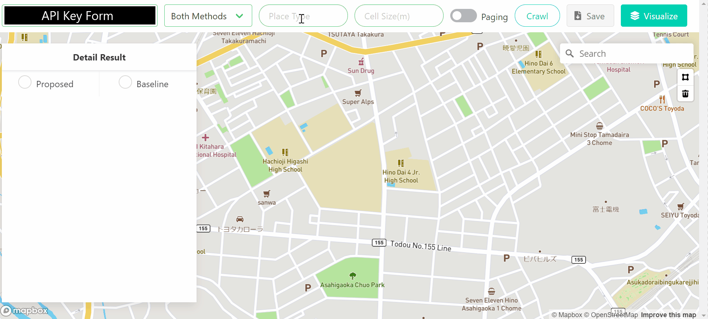

# Efficient Geo Crawler
This app is a GIS to crawl nearby place data in a target area with [Google Places API](https://cloud.google.com/maps-platform/places) and visualize them quickly. You can crawl place data with Intersection-based Method (Proposed Method) and Grid-based Method (Baseline Method), and then compare their efficiency.

## Demo
[Sample is Here.](https://efficient-geo-crawler.herokuapp.com/)


## Quick Start
This GIS is designed to run on your Heroku environment.<br>
You need [Heroku account](https://signup.heroku.com/) before quick start.

```
# 1. Clone to your local
$ git clone https://github.com/YokoyamaLab/efficient-geo-crawler.git

# 2. Deploy the app with Heroku CLI
$ heroku create
$ git push heroku prod:master

# 3. Run
$ heroku open
```

# Usage
## Main Feature
* Crawl&Visualize:<br>
Execute crawling when you click the button. After finishing crawling, you get the detail result in the Result Console and the visualization result on the map.

### Crawling Settings
* Target Area - **Required**:  <br>
You draw a target area freely with the polygon tool.

* API Key (Google Places API) - **Required**: <br>
[Get your API Key.](https://developers.google.com/places/web-service/get-api-key)

* Method Type - **Required**:<br>
Choose both methods or either Proposed Method or Baseline Method.

* Place Type - **Required**:<br>
Select a place type that you want to crawl. ([Place Type List](https://developers.google.com/places/web-service/supported_types))
<br>example: restaurant, lodging, store...

* Cell Size(m) - **Required only when using Proposed Method**:<br>
This parameter is needed to decide the size of the grid cells in Baseline method. The smaller this parameter, the more data you can crawl.

* Paging - **Optional**:<br>
When this is enabled, you can crawl max 60 place data for a single point. ([Detail](https://developers.google.com/places/web-service/search#PlaceSearchRequests))


## Sub Features
* Save:<br>
You can save the result with JSON file to your local.
* Only Visualize:<br>
You can visualize the saved result without crawling.
* Area Search:<br>
You can search for the area where you want to crawl data.<br>
example: Paris, Seattle, Tokyo...


# Libraries
## Server
* [@derhuerst/query-overpass](https://github.com/derhuerst/query-overpass)
* [@google/maps](https://github.com/googlemaps/google-maps-services-js/tree/%40google/maps)
* [Turf.js](https://turfjs.org/)
* [Socket.io](https://socket.io/)
* [sleep](https://github.com/erikdubbelboer/node-sleep)

## Front
* [Mapbox-GL-JS](https://github.com/mapbox/mapbox-gl-js)
* [Mapbox-GL-draw](https://github.com/mapbox/mapbox-gl-draw)
* [Mapbox-GL-geocoder](https://github.com/mapbox/mapbox-gl-geocoder)
* [Bulma](https://bulma.io/)

# Lisence
This GIS is licensed MIT.